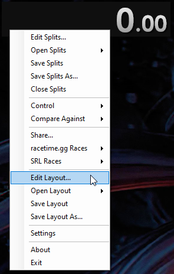
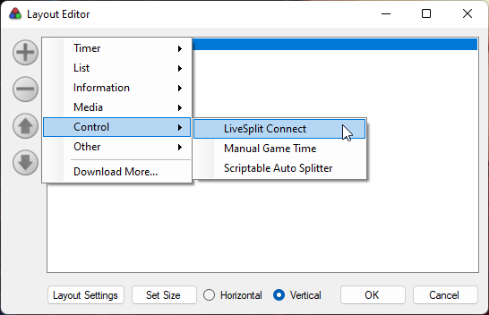
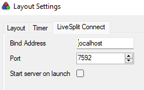
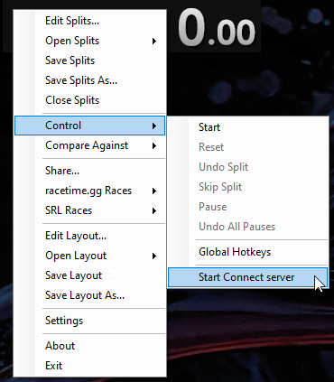

# LiveSplit Connect

LiveSplit Connect is a component for LiveSplit to access and control LiveSplit through an API.

For now, the only type of API supported is gRPC. A HTTP API could be implemented in the future.

Some features exposed on the gRPC API:

* Perform operation on the timer (Start, Stop, Pause, Reset).
* Control splits (Split, Unsplit, skip Split).
* Get info on the Game and Segments.
* Get and watch information on Time, Time Phase and current Split.

Tested on LiveSplit v1.8.20 on Windows 64bit.

## Installation

Download the [latest release](https://github.com/fuhrmannb/grpc-multiplexer/releases).
Then extract the content of the archive into the `Components` folder of your LiveSplit information.

## Usage

Start LiveSplit and edit your layout:

Then add LiveSplit Connect component in Control category:

If you double-click on the component, you can access to the following options:

* _Bind Address_: Address to listen for the gRPC server.
* _Port_: Port of the gRPC serveR.
* _Start server on launch_: if checked, the server will be started on LiveSplit launch.

Restart LiveSplit. Then you will be able to start the Connect server:

To test access to the gRPC API, you can use [BloomRPC](https://github.com/bloomrpc/bloomrpc).

To stop server, perform the same operation as start.

## Contributing

Pull requests are welcome. For major changes, please open an issue first to discuss what you would like to change.

Project is configured with Visual Studio Community 2022 and .Net Framework 4.8.

## License

[MIT](LICENSE)
